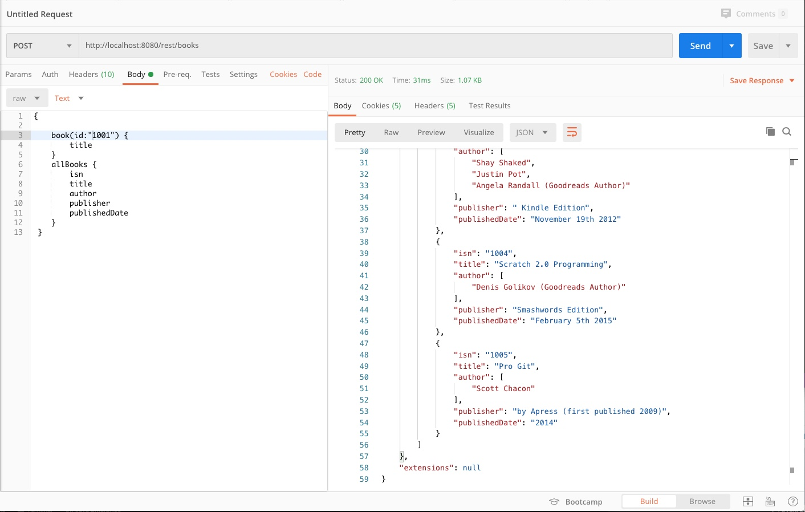

#### Springboot Java GraphQL

Commands

    $ java -version
    java version "1.8.0_221"
    
    $ mvn spring-boot:run
    server starts at port 8080
    
    

References:

- https://medium.com/@vinod827/spring-boot-app-with-graphql-2dd62a9e5c3e
- https://github.com/vinod827/acloudtiger-blog-posts
