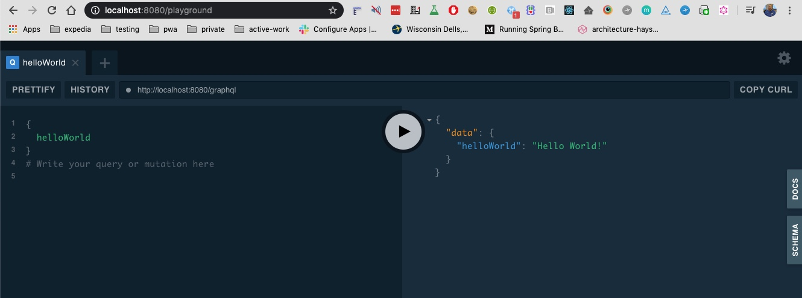

#### Reactive GraphQL Server

Commands

    $ java -version
    java version "1.8.0_221"
    
    

Reference:

- https://medium.com/expedia-group-tech/creating-a-reactive-graphql-server-with-spring-boot-and-kotlin-54aca7316470
